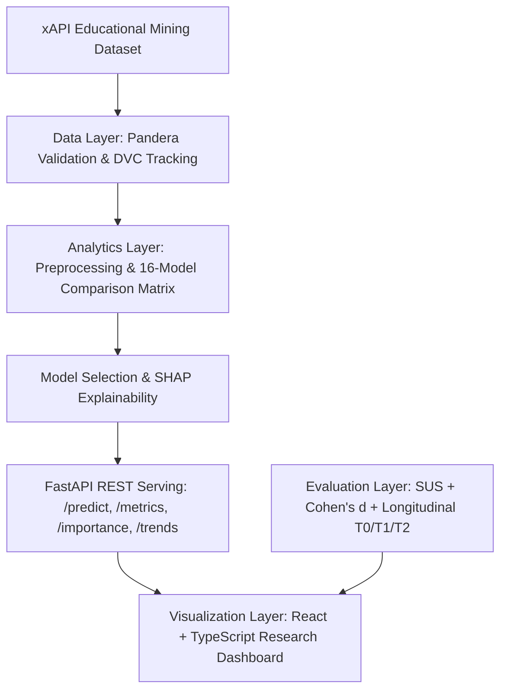

# SEB-XRIF: Scalable, Evidence-Based XR Integration Framework

An evidence-based, reproducible research and educational analytics framework designed for longitudinal XR (Extended Reality / Virtual Reality) educational research.

> **Architecture Notice**: FastAPI replaces Flask according to the current SEB-XRIF technical specification.

---

## 1. Research Background & Problem Statement
Immersive virtual reality (VR) and extended reality (XR) educational interventions often suffer from:
- **Small sample sizes & single-session evaluations** without long-term retention measurement.
- **Inconsistent evaluation methodologies** mixing usability with learning gain without standardized effect size calculations.
- **Lack of predictive modelling** connecting real learner behavioral engagement with academic performance tiers.
- **Black-box models** lacking pedagogical explainability (e.g. SHAP, feature attribution).
- **Non-reproducible analytics pipelines** preventing cross-institutional comparison.

SEB-XRIF provides a four-layer architecture to solve these challenges:
1. **Data Layer**: Immutable raw dataset ingestion, Pandera schema validation, and DVC versioning.
2. **Analytics Layer**: 16-model evaluation matrix, stratified 10-fold CV, Optuna optimization, SHAP & LIME interpretability.
3. **Visualization Layer**: Interactive React + TypeScript analytics dashboard with real-time inference and explainability.
4. **Evaluation Layer**: Rigorous System Usability Scale (SUS) scoring, Cohen's $d$ effect size calculation, and a longitudinal $T_0 \to T_1 \to T_2$ evaluation structure.

---

## 2. Core Framework Layers

---

## 3. Technology Stack

- **Backend / Analytics**: Python 3.10+, FastAPI, Uvicorn, Pydantic v2, SQLAlchemy, Scikit-learn, Optuna, SHAP, LIME, Pingouin, SciPy, Structlog.
- **Data & Pipeline**: Pandas, Pandera, DVC, MLflow.
- **Frontend / Dashboard**: React 19, Vite, TypeScript, Tailwind CSS, Lucide icons.
- **DevOps**: Docker Compose, PostgreSQL, Pre-commit, Pytest.

---

## 4. Implementation Roadmap (Phases)

| Phase | Description | Status |
|---|---|---|
| **Phase 1** | Environment & project scaffold, configuration, directory hierarchy | **Completed** |
| **Phase 2** | Dataset ingestion & Pandera schema validation (xAPI Educational Dataset) | In Progress |
| **Phase 3** | Preprocessing pipeline (ColumnTransformer, OneHotEncoder, Leakage prevention) | Next |
| **Phase 4** | Random Forest baseline with stratified 10-fold CV & Macro F1 | Planned |
| **Phase 5** | Complete 16-model comparison matrix | Planned |
| **Phase 6** | Model interpretability (Global & Local SHAP, Permutation importance) | Planned |
| **Phase 7** | MLflow experiment tracking & DVC pipeline reproducibility | Planned |
| **Phase 8** | FastAPI prediction & metrics API endpoints | Planned |
| **Phase 9** | React research dashboard & real-time inference views | Planned |
| **Phase 10** | SUS & Cohen's d evaluation engines + Longitudinal $T_0/T_1/T_2$ schemas | Planned |
| **Phase 11** | Unit & integration test suites (Serving parity, schema, SUS vectors) | Planned |
| **Phase 12** | Docker configuration & final academic validation report | Planned |

---

## 5. Responsible AI & Research Boundaries

> **Important**: This framework is an early-warning research and pedagogical support tool. Predictions are intended to guide timely academic interventions and investigate behavioural correlates, **never** to replace educator judgement or serve as gatekeeping mechanisms.
>
> All actual calculated results are strictly distinguished from published literature benchmarks (e.g. 75–83% ensemble benchmark, SUS 76.6, Cohen's $d$ 0.936) and future XR pilot measurements ($T_2$ retention).
